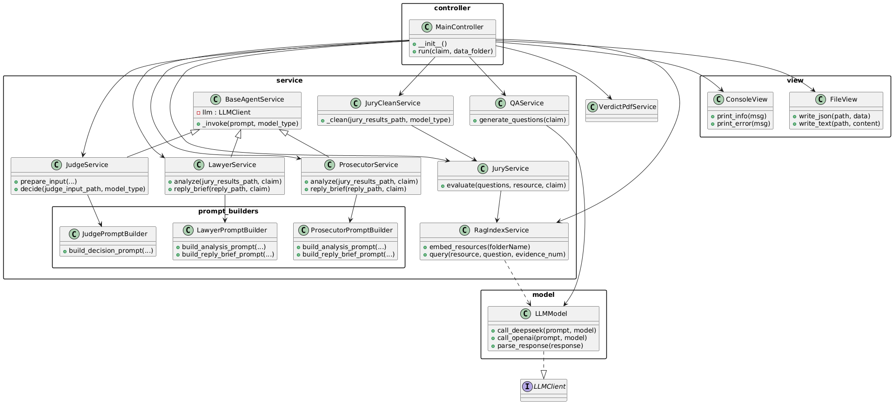
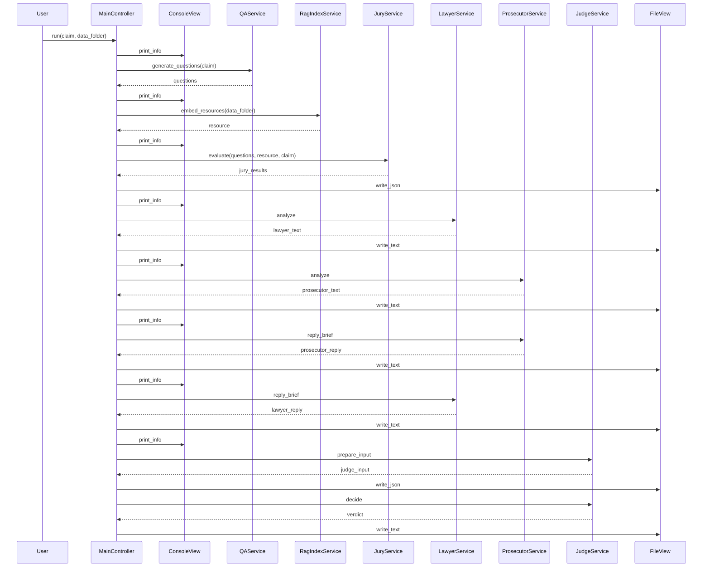

## Project Folder Structure

```bash
.
├── controller
│   └── main_controller.py
├── judge_input.json
├── judge_verdict.txt
├── jury_results.json
├── model
│   ├── data_models.py
│   └── llm_model.py
├── reply_brief
│   ├── lawyer_reply_brief.txt
│   └── prosecutor_reply_brief.txt
├── results # Automatically generated
│   ├── lawyer_results.txt
│   └── prosecutor_results.txt
├── rscFiles
│   └── Files(pdfs)
├── rscFilesIndex # Automatically generated by rscFiles
│   ├── faiss_index.bin
│   └── metadata.json
├── runs.py # Entry point
├── service
│   ├── __pycache__
│   ├── base_agent.py
│   ├── judge_service.py
│   ├── jury_service.py
│   ├── lawyer_service.py
│   ├── prompt_builders
│   ├── prosecutor_service.py
│   ├── qa_service.py
│   └── rag_service.py
└── view
    ├── console_view.py
    └── file_view.py
```

## UML


## Execution flow

