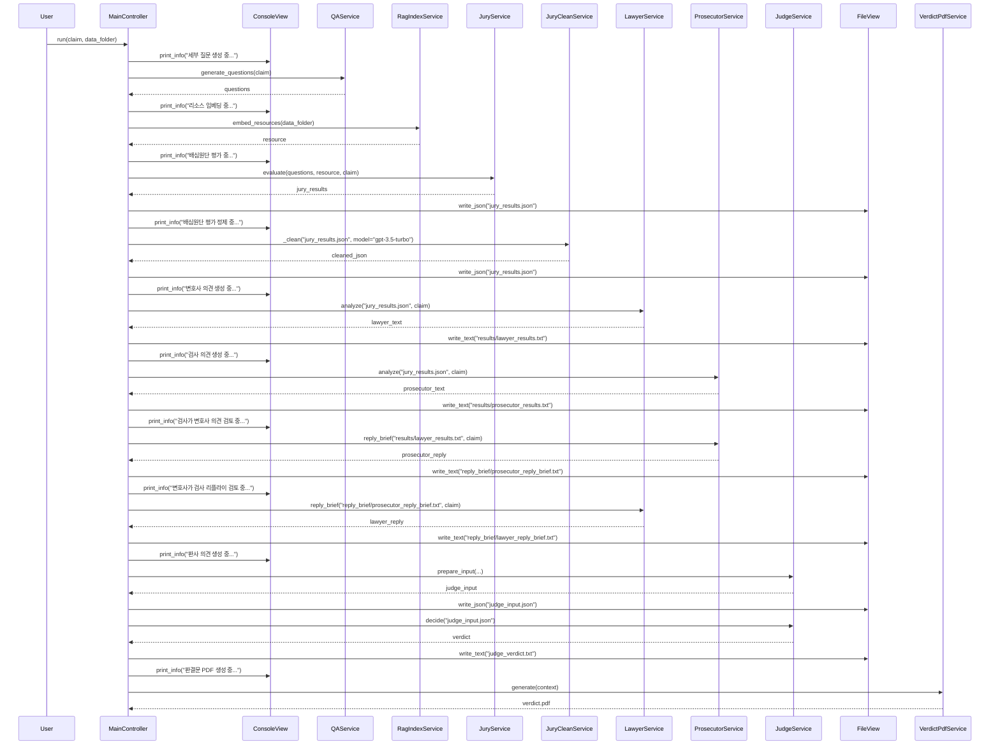

## 1. Overview
<details>
<summary>🇰🇷 한국어 설명</summary>
> 본 프로그램은 법정(Court)을 모방해 사용자 입력(기후 변화에 대한 주장)을 판단하고 최종 판결문을 Latex 형식으로 뽑아 PDF를 생성한다.

기후변화에 대한 논의는 과학·정책·사회 전반에 걸쳐 매우 복잡하게 얽혀 있다. 지구 온난화 현상을 효과적으로 완화하기 위해서는 국가 간, 세대 간, 산업계·학계·시민사회가 모두 동의하는 정책적 합의가 필수적이다. 그러나 현장에서 제기되는 다양한 주장과 반론들은 전문성이 요구되고, 일반인들이 이를 종합적으로 이해하기란 사실상 쉽지 않다. 그 결과, 기후변화 이슈에 직면한 개인이나 공동체는 정보 과부하에 빠지거나, 검증되지 않은 주장에 오히려 회의감을 느끼는 도전적 상황에 놓이곤 한다.

예컨대, 다음과 같은 주장을 살펴보자.

> “지구 온난화는 기후 모델이 예측한 만큼 진행되지 않고 있다. 이는 식물의 광합성이 예상보다 더 많은 CO₂를 흡수하고 있기 때문이다. 기후 변화는 거짓말이다.”

이와 같은 주장은
1. 과학적 근거의 복잡성 (여러 기후 모델과 관측치의 해석 차이)
2. 데이터 해석의 편향 가능성 (특정 연구결과만 강조)
3. 일반 독자의 정보 접근성 한계를 모두 동시에 내포하고 있다.

필자는 기후변화 정보의 복잡성과 일반 대중의 접근성 한계를 동시에 해결하기 위해, 본 연구에서는 다음과 같은 RAG 기반 LLM 에이전트 시스템을 제안·구축한다.
> 1. 법정 모방(Court Simulation) 인터페이스
> - 사용자 질문을 “원고(주장) 제기 → 배심원(데이터) 평가, 질문 확장 → 변호·검사(찬반 논리) 변론 → 판사(요약·결론)”의 절차로 순차 처리
> 2. IPCC 보고서 전 체계 인용 및 검색
> - 과거 제1차 보고서부터 최신 보고서, 특별 보고서(e.g. Global Warming of 1.5°C)까지 pdf 전 내용을 메타데이터와 함께 색인한다.
> - RAG(Retrieval-Augmented Generation) 기법으로 사용자의 질의 의도에 맞는 문단·수치·인용문을 찾아 프롬프트에 제공한다.
> 3. 최종적으로 잘못된 정보와 과장·왜곡된 해석을 판별할 수 있는 평가지표(Accuracy, Misleading, Overgeneralization, Unsupported, Inaccurate) 체계를 제안한다.
</details>

<details>
<summary>🇬🇧 English description</summary>

> This program simulates a court to evaluate user input (claims about climate change) and generate a final verdict in LaTeX format as a PDF.

Discussions around climate change are deeply intertwined across scientific, policy, and social domains. To effectively mitigate global warming, policy consensus among nations, generations, industries, academia, and civil society is essential. However, the diverse claims and counterarguments that arise in the field require specialist knowledge, making it practically impossible for the general public to fully understand them. As a result, individuals or communities facing climate change issues may experience information overload or become skeptical of unverified claims, placing them in a challenging situation.

For example, consider the following claim:

> “Global warming is not proceeding as predicted by climate models. This is because plants are absorbing more CO₂ through photosynthesis than expected. Climate change is a hoax.”

Such a claim encompasses all of the following at once:
1. The complexity of scientific evidence (differences in interpretation among various climate models and observations)  
2. Potential bias in data interpretation (emphasizing specific research findings)  
3. Accessibility limits for general readers  

To address both the complexity of climate information and the accessibility challenge for the general public, this study proposes and builds the following RAG-based LLM agent system.  
> 1. Court Simulation Interface  
> - Sequentially processes user queries through the steps “Plaintiff (Claim) → Jury (Data) Evaluation & Question Expansion → Defense/Prosecution (Arguments for and against) → Judge (Summary & Conclusion)”  
> 2. Comprehensive Citation & Retrieval of IPCC Reports  
> - Indexes all content from the First Assessment Report to the latest reports and special reports (e.g., *Global Warming of 1.5°C*) along with metadata.  
> - Uses Retrieval-Augmented Generation (RAG) to find paragraphs, data, and citations that match the user’s query intent and supplies them to the prompt.  
> 3. Evaluation Framework  
> - Proposes a system of metrics (Accuracy, Misleading, Overgeneralization, Unsupported, Inaccurate) to identify false information and exaggerated or distorted interpretations.  
</details>

해당 프로젝트는 기개발하였던 easy-rag-llm 라이브러리에 의존합니다. (https://github.com/Aiden-Kwak/easy_rag_llm)


## 2. Requirements
* install
```bash
brew install --cask mactex # for Mac
pip install -r requirements.txt
```

* .env
```bash
OPENAI_API_KEY=...

DATA_FOLDER='./rscFiles'

CLAIM="Global warming is not progressing as predicted by climate models. This is because plant photosynthesis is absorbing more CO₂ than expected. Climate change is a lie."
```

## 3. Project Folder Structure

```bash
.
├── controller
│   └── main_controller.py
├── judge_input.json # auto generated
├── judge_verdict.txt # auto generated
├── jury_results.json # auto generated
├── model
│   ├── data_models.py
│   └── llm_model.py
├── reply_brief # auto generated
│   ├── lawyer_reply_brief.txt
│   └── prosecutor_reply_brief.txt
├── requirements.txt
├── results          # auto generated
│   ├── lawyer_results.txt
│   ├── prosecutor_results.txt
│   ├── verdict.aux
│   ├── verdict.log
│   ├── verdict.pdf
│   ├── verdict.tex
│   └── verdict_build.log
├── rscFiles
│   ├── IPCC reports (pdf)
├── rscFilesIndex    # auto generated (faiss index)
│   ├── faiss_index.bin
│   └── metadata.json
├── runs.py          # entry point
├── service
│   ├── base_agent.py
│   ├── judge_service.py
│   ├── jury_clean_service.py
│   ├── jury_service.py
│   ├── lawyer_service.py
│   ├── pdf_service.py
│   ├── prompt_builders
│   ├── prosecutor_service.py
│   ├── qa_service.py
│   └── rag_service.py
├── templates
│   └── verdict.tex.j2
└── view
    ├── console_view.py
    └── file_view.py
```

## 4. UML


## 5. Execution flow

